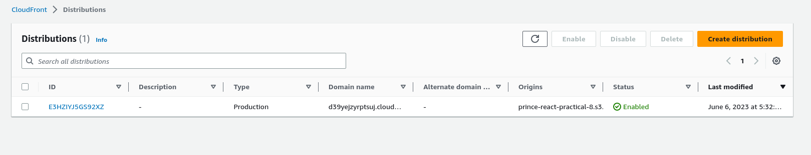
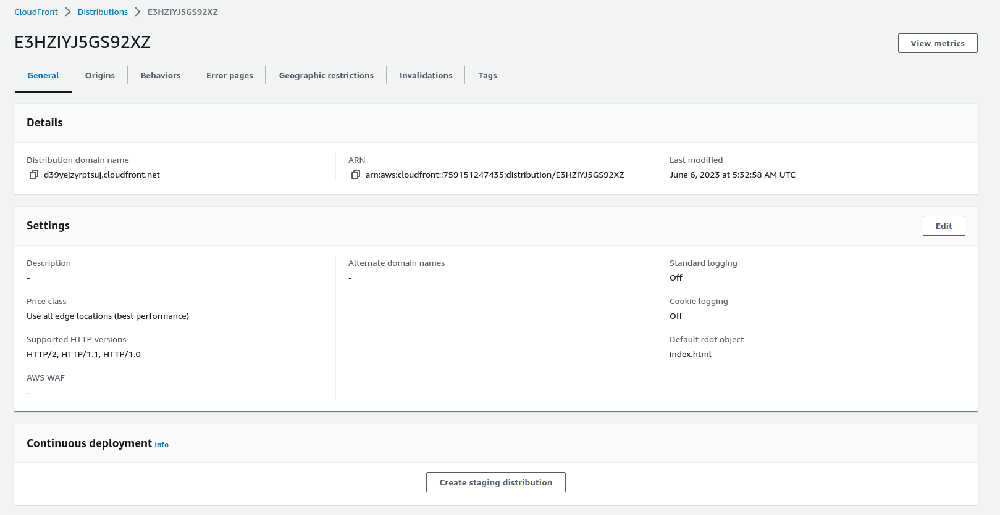
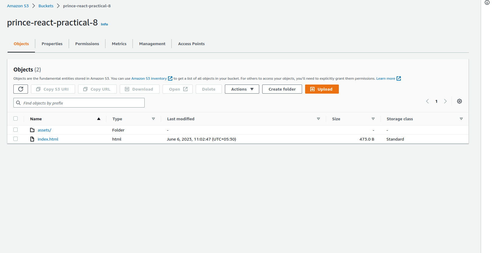

# 
React-Practical-8

 

---

## About Practical

---

- deploy build on Amazon S3 or any app service

 

---

## Live Working Link

---

 

- [https://d39yejzyrptsuj.cloudfront.net/](https://d39yejzyrptsuj.cloudfront.net/)

 

---

## Technologies

---

- Project
  - Html
  - Css
  - Bootstrap
  - Javascript
  - ReactJs
  - Redux
  - RTK Query
- Deploy
  - AWS S3
     

---

## Deploy Setup Step

---

 

- ### **Create AWS Account**

- ### **Create a S3 bucket in AWS console**

- ### **create build of the Project**

- ### **Add build files in the S3 bucket in AWS**

- ### **Create Cloud Front Distributions For Deploy Project Publicly**

- ### **Attech Cloud Front service with Project bucket**

- ### **Attech Cloud Front service police in Project bucket**

- ### **Get public URL**

 

---

## About Features

---

 

- The User List APP application includes the following features:

  - You can able to show all user list
  - on hover any specific user you can able to she it's profile card
  - Data Fetch Using RTK Query So the Unique Data Fetched only Once

- API : [https://test-react-5cd74-default-rtdb.firebaseio.com/users.json](https://test-react-5cd74-default-rtdb.firebaseio.com/users.json)
   

---

## About Practical Components

---

 

- Components Structure

**App** => All Application Components Render Here

- **Interface** => For Type Casting All Data Interface are Listed Here
- **Store** => Featching and Give All Manuplation and Data of Application
- **Provider** => Provide Data of Application using Redux from `store component`
  - **UserList** => Here I List All User Data
  - **Profile** => This Component Show all Specific user _Card_

 

---

## Unique of the Practical

---

 

- Unique Data Fetched only Once
- When any Profle care Show only the specific Profile card is render , not any other are rendering

 

---

## AWS Demo

---

 

 

---

## Live Practical Demo

---

 

